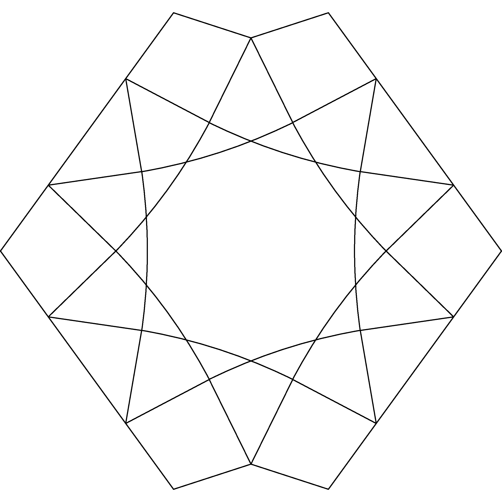

# Twisty Puzzle Asy
Twisty Puzzle Asy is an Asymptote library for Twisty Puzzles visualization, sketching and design. Its main goal is to speed up certain tasks for designers of twisty puzzles. Being implemented in Asymptote, this library is useful together with TeX to produce high quality documents containing 2D schemes or 3D models.

## Prerequirements
You will need Asymptote (https://asymptote.sourceforge.io/) runtime to use this project. Also, Asymptote is shipped as part of TeX distribution such as TexLive (https://www.tug.org/texlive/). TeX is necessary to produce PDF documents with incorporated 3D models.

## Project Content
The library code is located in `lib` folder and consist of:
* `color.asyhdr` - several color definitions,
* `rubiks.asyhdr` - Asymptote module for creation of 3D sketches of twisty puzzles,
* `algorithm.asyhdr` - Asymptote module for creation of 2D sequences of twisty puzzles algoritms,
* `sun.asyhdr` - Asymptote module to automate creation of 3D sketches of sun twisty puzzles,
* `sticker.asyhdr` - Asymptote module for creation of  face sketches of sun twisty puzzles and experimental creation of their stickers design,
* `make-pdf-3D.sh` - BASH script for creation of PDF page with embedded 3D model from Asy source.

`src` folder contains numerous examples of Asymptote code using this library, including:
* `model` - 3D models of different twisty puzzles,
* `sun/model` - 3D models of different sun twisty puzzles,
* `algorithm` - sequences of different twisty puzzles algorithms, it shares `data` with `model` folder for puzzles models,
* `sun/config` - different face configurations of sun twisty puzzles,
* `sun/sticker` - examples of stickers designs for sun twisty puzzles.

`out` folder contains PDF and PNG output of all these examples, its structure resembles that of `src` folder. When model is 3D, the PDF output is prepared as document containing 3D model, which can be interactively previewed in recent Adobe Acrobat Reader.

Asymptote supports output in more formats. Consult `lib/Makefile` for options.

## Usage
The easiest way to start creating with Twisty Puzzle Asy is to copy and modify an existing Asymptote code. Put in the same folder `*.asyhdr` dependencies. Then use:
* `asy -V <file>.asy` for 3D interactive preview in OpenGL canvas;
* `asy -f "png" <file>.asy` to create PNG image from Asymptote source. Asymptote supports also `"pdf"`, `"eps"` and other output formats (consult Asymptote documentation for more information);
* `make-pdf-3D.sh <file>.asy` to create PDF page with embedded 3D model.

## Creation of sketches
<p align="center"></p>

### Vertex declaration
Asymptote uses Cartesian coordinate system to represent points. Type `pair` is used for 2D, `triple` is for 3D:
```
pair A = (0.8, -1.2);
triple B = (-0.2, 1.5, -2.7);
```
However, to easy transform the whole model, `rubiks.asyhdr` defines the following:
```
triple O = (0, 0, 0);
triple X = (1, 0, 0);
triple Y = (0, 1, 0);
triple Z = (0, 0, 1);
```
So, `triple B` could be also defined as:
```
triple B = -0.2 * X + 1.5 * Y - 2.7 * Z;
```

### Transformation declaration
Asymptote uses types `transform` and `transform3` for transformation of `pair`s and `triple`s. However, for twisty puzzles moves only rotations are useful:
```
transform rotationIn2D = rotate(A, 45); // Rotation by 45 degree counter-clockwise with the center in pair A
transform3 rotationIn3D = rotate(B, -120); // Rotation by 120 degree clockwise with axis O--B toward camera
```

`rubiks.asyhdr` defines function `setView` to specify camera orientation:
```
setView(-65, 25, 75); // Angles of rotations expressed in degrees with axes X, Y and Z.
```
This function affects values of `X`, `Y` and `Z`. If all the vertices are defined using them, all geometry is transformed.

### Polygons and stickers
Asymptote defines paths as points connected using different operators. For twisty puzzles needs, polygonal paths are most often used. They can be created using `--` operator. `rubiks.asyhdr` defines functions `polygon` to construct colored polygon, or `stick` to construct a polygon and put a colorful sticker on it. Optionally, you can specify the transform in their last parameter:
```
polygon(X--Y--(X+Y), Navi);
stick(O--X--Y, Turquoise, rotationIn3D);
```
Default body color is `Black`, you can redefine it by changing the value of `Background` before calling `stick`:
```
Background = White; // From now on the puzzle body is White
stick(O--X--Y, Black); // Black sticker on White body
```

## Algorithm sequences
<p align="denter"></p>

`algorithm.asyhdr` redefines function `stick` to always use grey color. This is done to permit reusing of existing functions for model creation. When some sticker needs to be highlighted (with darker shade of grey), you can use `highline` instead of or after `stick`:
```
highline(O--X--Y);
```

To start a sequence of images, use `figureBegin` without arguments. Use `figureNext` to move to a new image next to existing, `figureLine` to start new line below existing and `figureEnd` to finish a sequence:
```
figureBegin();
// Draw something in the 1st image
figureNext();
// Draw something next to the 1st image
figureNext();
// Draw something next to the 2nd image
figureLine()
// Draw something down to the 1st line
figureNext();
// Draw something next to previous image at the 2nd line
figureEnd();
```
The number of rows is not limited as well as the number of images in a row.

Additionally to functions to layout the sequence of images, `algorithm.asyhdr` defines several drawing functions: `makeChange(<begin-sticker>, <end-sticker>)` draws blue arrow indicating the position of some sticker before and after applying some algorithm. This arrow is sensible to sticker orientation. `makeMove(<center>, <angle>)` function draws blue round arrow of a twist, `makeTurn(<angle>)` draws black round arrow of turn of whole puzzle. These functions allow also optional arguments, see examples under `src/algorithm` for details.

## Face configuration for sun twisty puzzles
`sticker.asyhdr` and `sun.asyhdr` modules deal with sun twisty puzzles. To describe a face of a such puzzle, an array of boolean values is used. The length of this array corresponds to order of twist axis, each `true` value corresponds to a vertex stop, `false` corresponds to an edge stop:
```
bool[] conf = new bool[] {true, false, true, true, false, true, false, true, true, false}; // 10-fold rhomb face of Sky Eyes
```

## Creation of sticker configurations and designs for sun twisty puzzles
`sticker.asyhdr` module defines function `drawStickerConfiguration(<configuration>)` to sketch the face configuration:
<p align="center"></p>

Additionally `drawFaceStickers(<configuration>, <color>)` and `drawVertexStickers(<axis-order>, <color>)` functions are defined to prepare stickers layout of a face and cluster of 4 vertices to be used by cutter plotter. Unfortunately, the scaling and tolerance factors are quite imprecise, so optional parameters are introduced to tune the output for real needs. See `src/sun/sticker` for examples: , .

## Creation of sketches of sun twisty puzzles
<p align="center"></p>

`sun.asyhdr` defines several structures for sun puzzles needs:
* `face` to represent puzzle faces,
* `vertex4` to represent clusters of 4 vertices,
* `vertex5` to represent clusters of 5 vertices (this type of vertices is more like a 5-fold face, it it not yet realized in any produced sun puzzle),
* `move` to represent rotation of a face or a vertex cluster.

A `face` contains all the stickers of some face, which usually have the same color. To construct a `face` call constructor or `constructFace` function, to draw it call `draw` method or `drawFace` function:
```
bool[] conf = new bool[] {true, false, true, true, false, true, false, true, true, false};
face f = face(X+Y, X+Y+Z, conf); // Constructs a face with center in X+Y and initial stop at X+Y+Z
f.draw(Blue); // Draws face f with Blue color
```
or:
```
bool[] conf = new bool[] {true, false, true, true, false, true, false, true, true, false};
face f = constructFace(X+Y, X+Y+Z, conf); // Constructs a face with center in X+Y and initial stop at X+Y+Z
drawFace(f, Blue); // Draws face f with Blue color
```

It is also possible to draw a face whose some or all stickers are in mid-turn. For this, method `draw` and function `drawFace` accepts optional arguments:
```
f.drawFace(Blue, rotate(-20, X+Y)); // Draws face f rotated by 20 degrees clockwise with axis O--(X+Y) and Blue color
drawFace(f, Blue, rotate(-20, X+Y)); // Same as above
f.drawFace(Blue, rotate(-20, X-Z), 1); // Draws face f whose rotated elements are near the stop of configuration with index 1
drawFace(f, Blue, rotate(-20, X-Z), 1); // Same as above
```

When some face is involved in more than one move, you can pass any number of `move` arguments instead:
```
f.draw(Blue, move(rotate(-20, X-Z), 1), move(rotate(20, Y-Z), 4)); // Draws face f whose elements near edge 1 and 4 are rotated
drawFace(f, Blue, move(rotate(-20, X-Z), 1), move(rotate(20, Y-Z), 4)); // Same as above
```

Besides drawing actual face, `drawFace` draws also internal surfaces otherwise hidden in case optional arguments are used, so there is no need to manually create them.

Before creating or drawing of clusters of vertices, the faces need to be _glued_. This is necessary, because almost all such puzzles are [fudged](https://twistypuzzles.com/twistypedia/index.php/Fudging), or have imprecise geometry, and their vertices do not always match. To do so, call `glueFaces`, which accepts 2 adjacent faces or 3 faces with common 3-vertex:
```
glueFaces(a, b);
glueFaces(a, c, c);
```
These functions try to detect matching vertices of these faces and change their coordinates to their average position. This is done up to expected precision, which for sun sticker configuration is considered 1/10 of smallest sticker side. This expected precision is computed and returned by both variants of function. Additionally, new precision can be passed to both variants of function as the last optional argument. In this case it is not computed. It may happen that real precision for faces gluing in not sufficient. In this case try to pass a larger value as precision to `glueFaces`:
```
real precision = 5 * glueFaces(a, b); // Consider real precision 5x of expected precision
glueFaces(b, c, precision); // Use new precision
glueFaces(c, d, precision); // Use new precision
```
Even if the expected precision is sufficient for faces gluing, it is better to pass it to each `glueFaces` call starting from the 2nd. In this case it is not computed again and again.

After gluing the faces it is possible to construct and draw clusters of 4 vertices:
```
vertex4 v4 = vertex4(a, b, c, d); // Constructs a cluster of 4 vertices
v4.draw(Tan); // Draws cluster of 4 vertices with Tan color
```
or:
```
vertex4 v4 = constructVertex4(a, b, c, d); // Constructs a cluster of 4 vertices
drawVertex4(v4, Tan); // Draws cluster of 4 vertices with Tan color
```
The faces passed to constructor or `constructVertex4` should be glued (`a-b`, `b-c`, `c-d` and `d-a`) and their order should be counter-clockwise when looking at this vertex cluster.

Like in case of faces, `draw` method and `drawVertex4` function accepts optional arguments for transform and index. In this case, 2 vertices out of 4 are drawn rotated. These 2 vertices belong to the face whose position in constructor or `constructVertex4` function equals to index passed to `draw` method or `drawVertex4` function (starting with 0):
```
vertex4 v4 = vertex4(a, b, c, d); // Constructs a cluster of 4 vertices
v4.draw(Tan, <transform>, 2); // Draws rotated the vertices belonging to c whose index in argument list is 2
v4.draw(Tan, move(<transform1>, <idx1>), move(<transform2>, <idx2>), ...); // Draws vertex cluster with multiple rotations
```
or:
```
vertex4 v4 = constructVertex4(a, b, c, d); // Constructs a cluster of 4 vertices
drawVertex4(v4, Tan, <transform>, 2); // Draws rotated the vertices belonging to c whose index in argument list is 2
drawVertex4(v4, Tan, move(<transform1>, <idx1>), move(<transform2>, <idx2>), ...); // Draws vertex cluster with multiple rotations
```

Like drawing faces, when optional arguments are passed to `drawVertex4`, the function takes care of all otherwise hidden surfaces to be drawn.

Clusters of 5 vertices (presented in Tan color at the image above) are constructed and drawn in similar manner:
```
vertex5 v5 = vertex5(a, b, c, d, e);
v5.draw(Tan);
```
or:
```
vertex5 v5 = constructVertex5(a, b, c, d, e);
drawVertex5(v5, Tan);
```

Unlike cluster of 4 vertices containing only vertex parts, cluster of 5 vertices besides vertex parts contains intermittent parts, which can be vertices or edges. The 3rd optional boolean argument passed to `draw` method and `drawVertex5` function indicates which configuration to use:
```
v5.draw(Tan, true); // Default, use vertices in between
drawVertex5(v5, Tan, true); // Same as above
v5.draw(Tan, false); // Use edges in between
drawVertex5(v5, Tan, false); // Same as above
```

Finally, 2 more arguments can be passed to `draw` method or `drawVertex5` function to transform 2 out of 5 vertices, similar to such method of `vertex4` struct or `drawVertex4` function:
```
vertex5 v5 = vertex5(a, b, c, d, e);
v5.draw(Tan, true, <transform>, 2); // Draws rotated the vertices belonging to c whose index in argument list is 2
v5.draw(Tan, move(<transform1>, <idx1>), move(<transform2>, <idx2>), ...); // Draws vertex cluster with multiple rotations
```
or:
```
vertex5 v5 = constructVertex5(a, b, c, d, e);
drawVertex5(v5, Tan, true, <transform>, 2); // Draws rotated the vertices belonging to c whose index in argument list is 2
drawVertex5(v5, Tan, move(<transform1>, <idx1>), move(<transform2>, <idx2>), ...); // Draws vertex cluster with multiple rotations
```
As before, in case of passing the last 2 arguments to `draw` method or `drawVertex5` function, it takes care of drawing  surfaces otherwise hidden.

## Manually embed 3D models in (La)TeX documents
BASH script `lib/make-pdf-3D.sh` creates one PDF page with embedded 3D model out of Asy source code. The contents of this page is very specific, and often is not what you want. You can use this script as a code snippet to manually embed 3D models produced by this library into your PDF documents. For this, you need `media9` (La)TeX package.

You can define a macro similar to the following in preamble of your TeX documents:
```
\usepackage[xetex, 3Dtoolbar, 3Dmenu]{media9} % This is for using xetex processor, omit it for pdflatex
...
\newcommand{\includemodel}[1]{
\begin{center}
\includemedia[3Droo = 500, width = 0.8\textwidth]{
\includegraphics[width = 0.8\textwidth]{#1.pdf}
}{#1.prc}
```

Then you need `<model>.pdf` image. It is used to preview your model when 3D mode is inactive:
```
asy -f "pdf" <model>.asy
```
Also, you need `<model>.prc` in actual 3D format. To produce it, use:
```
asy -f "prc" <model>.asy
```
It is a good idea to _not modify_ your Asy code between producing PDF and PRC files.

Next, somewhere in your TeX document you can include your `<model>` as:
```
\includemodel{<model>}
```
Of course, the model can be included inside a `figure` environment:
```
\begin{figure}[ht!]
\includemodel{<model>}
\caption{Some fancy 3D model.}\label{some-fancy-model}
\end{figure}
```

## Disclaimer
I created this library for my own needs. I share it in a hope to be useful also for others. I have no plan to actively develop or support this project further. Still, I am open to obvious bug reporting (and especially fixing), suggestions and other improvements. You can reach me (Alexandru Popa) by email address alpopa at gmail dot com.
